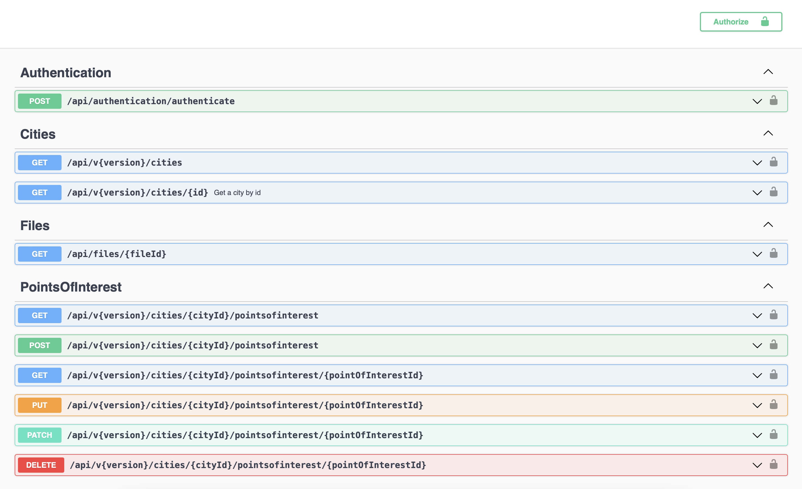

# CityInfo: RESTful API with ASP.NET 6

This is an api that provides city information. `City` class contains `Point of Interest` collection. Point of Interest is designed as a sub resource of City resource.

Using the endpoints you can add, update (partially or fully) and delete cities and points of interest. Moreover, you can execute several queries to fetch information (with pagination).

## Tools and Technologies

- This project is created using ASP.NET 6.
- This is a project where I followed REST principles.
- Entity Framework Core is the selected ORM tool.
- Entity Framework Core Tools is used for code-first database migrations.
- Sqlite is selected as database.
- Swashbuckle package is used to document the api.
- Bearer is used for authorization scheme and JWT token is used.
- Microsoft MVC Versioning package is used for api versioning.
- Standard Microsoft dependency injection package is used.
- Serilog is the selected logging package to implement different kinds of sink.
- Lastly, in patch endpoints JsonPatch package is utilized.

    
<strong style="font-size: x-large">Swagger UI</strong>

